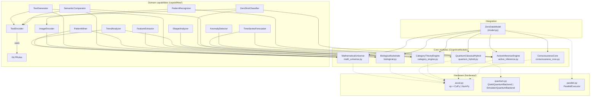

# Zero-Data Model — System Architecture

This document describes the architecture of the Zero-Data Model: a self-sufficient
cognitive system that requires **no external training data**. It covers the
three-layer stack, module dependencies, the `think()` data flow, the hardware
acceleration stack, the on-disk file tree, and the design principles that hold
the system together.

All class and method names cited below are taken verbatim from the source under
`src/zero_data_model/`.

---

## 1. High-Level Architecture

The system is organized as three layers, with `ZeroDataModel` (in
`src/zero_data_model/model.py`) as the single integration point that owns one
instance of every core module and every domain capability.

```
                         ┌─────────────────────────────────────────────┐
                         │            ZeroDataModel (model.py)         │
                         │   think() · classify_text() · forecast()    │
                         │   recognize_pattern() · solve() · ...       │
                         └────────────────────┬────────────────────────┘
                                              │ owns / composes
            ┌─────────────────────────────────┼─────────────────────────────────┐
            │                                 │                                 │
            ▼                                 ▼                                 ▼
  ┌──────────────────────┐     ┌──────────────────────────────┐    ┌──────────────────────────┐
  │  DOMAIN CAPABILITIES │     │        CORE MODULES (6)      │    │   HARDWARE LAYER         │
  │  (capabilities/)     │     │       (root of package)      │    │   (hardware/)            │
  │                      │     │                              │    │                          │
  │  NLP   Vision        │◄────┤  ConsciousnessCore           │◄───┤  accel.py  (CuPy/NumPy)  │
  │  Analytics  Rules    │     │  ActiveInferenceEngine       │    │  quantum.py (Qiskit/sim) │
  │                      │     │  CategoryTheoryEngine        │    │  parallel.py (joblib)    │
  │  compose core +      │     │  QuantumClassicalHybrid      │    │                          │
  │  rule priors         │     │  BiologicalSubstrate         │    │  auto-detected, graceful │
  │                      │     │  MathematicalUniverse        │    │  degradation to NumPy    │
  └──────────────────────┘     └──────────────────────────────┘    └──────────────────────────┘
```

- **Hardware layer** (`src/zero_data_model/hardware/`) — auto-selects the best
  available backend (GPU arrays, real Qiskit circuits, parallel workers) and
  degrades to pure NumPy on CPU when an optional dependency is missing.
- **Core modules** (`src/zero_data_model/*.py`) — six `CognitiveModule`
  subclasses that each implement `process()`, `predict()`, `update()`. They are
  theory-driven (consciousness, active inference, category theory, quantum,
  biology, mathematics) and self-generating.
- **Domain capabilities** (`src/zero_data_model/capabilities/`) — twelve
  user-facing capabilities across NLP, Vision and Analytics. Each one composes
  one or more core modules with a small rule library (`rules.py`) used as
  inductive prior — never as learned weights.

`ZeroDataModel.__init__` wires the layers together: it instantiates the six core
modules, then constructs each capability, injecting the shared core-module
instances (e.g. `SemanticComparator(self.nlp_text_encoder, self.math_universe,
self.category_engine)`). All capabilities therefore share a single set of core
modules, which is what makes cross-domain transfer cheap.

---

## 2. Module Dependency Graph

The diagram below shows which core module each capability depends on, and which
hardware backend each core module can use. Solid arrows are hard dependencies
constructed in `model.py`; dashed arrows are optional hardware acceleration.



Notes:

- `TextEncoder`, `ImageEncoder` and friends also pull a `*Rules` object from
  `rules.py`; the rules are minimal inductive priors (stop-words, Sobel kernels,
  moving-average windows) — not data.
- `ZeroDataModel.think()` runs every core module's `process()` through
  `ParallelExecutor.map_modules()`, so the six modules execute concurrently when
  more than one core is available.

---

## 3. Data Flow: the `think()` cycle

`ZeroDataModel.think(input_data=None)` is the cognitive heartbeat. With no
argument it **self-generates** an input from `BiologicalSubstrate.dna_storage`
and `MathematicalUniverse.fractal`; with an argument it pads the array to
`self.dim` and wraps it in a `Signal`. The signal then flows through every core
module in parallel, is integrated, reflected upon, predicted, and finally
updated.

```
                    input_data (np.ndarray | None)
                              │
                   ┌──────────┴──────────┐
                   │  None?              │ yes -> _self_generate()
                   │  else: pad to dim   │       DNAStorage.generate() + FractalGenerator.generate()
                   └──────────┬──────────┘
                              ▼
                         Signal(data)
                              │
        ┌─────────────────────┼─────────────────────┐   ParallelExecutor.map_modules()
        │                     │                     │   (concurrent when n_workers > 1)
        ▼                     ▼                     ▼
  ConsciousnessCore   ActiveInferenceEngine   ...4 more modules
  .process(signal)    .process(signal)        .process(signal)
        │                     │                     │
        └──────────┬──────────┴─────────────────────┘
                   ▼
         _integrate(results)        mean of padded module outputs -> integrated Signal
                   │
          ┌────────┴────────┐
          ▼                 ▼
  consciousness.reflect()  ParallelExecutor.map(m.predict, modules)
  (SelfModel metacognition)  -> list[Prediction]
          │                 │
          │                 ▼
          │        mean(pred.uncertainty) -> mean_err
          │                 │
          │                 ▼
          │        for m in modules: m.update(mean_err)
          │
          ▼
   return Signal(data=integrated.data,
                 metadata={cycle, self_reflection, module_count})
```

Key points (all in `src/zero_data_model/model.py`):

- `_self_generate()` blends 50/50 a DNA-crossover signal
  (`biological.dna_storage.generate`) with a fractal-iterated signal
  (`math_universe.fractal.generate`). This is the **zero-data** input source.
- `_integrate()` pads each module output to a common length and takes the
  per-coordinate mean — a simple Global-Workspace-style integration.
- `consciousness.reflect()` returns a `Signal` whose `metadata` carries
  `self_confidence` and `history_len` from `SelfModel` — the system's
  metacognitive readout.
- Every module's `update(mean_err)` nudges its internal parameters by a
  prediction-error-scaled noise term, closing the predictive-processing loop.

---

## 4. Hardware Acceleration Stack

Three independent acceleration paths, each with a pure-Python fallback so the
system runs anywhere NumPy runs.

```
┌──────────────────────────────────────────────────────────────────────────┐
│                        application code                                  │
│              ZeroDataModel · QuantumClassicalHybrid · ...                │
└─────────────┬───────────────────────┬───────────────────────┬────────────┘
              │                       │                       │
              ▼                       ▼                       ▼
   ┌─────────────────────┐ ┌─────────────────────┐ ┌─────────────────────┐
   │  accel.py           │ │  quantum.py         │ │  parallel.py        │
   │  array module `xp`  │ │  quantum backend    │ │  ParallelExecutor   │
   ├─────────────────────┤ ├─────────────────────┤ ├─────────────────────┤
   │ CuPy (CUDA GPU)     │ │ QiskitQuantumBackend│ │ ThreadPoolExecutor  │
   │   if cuda runtime   │ │  (StatevectorSampler│ │  (joblib threading) │
   │   getDeviceCount>0  │ │   RY+CNOT ansatz)   │ │  when n_workers>1   │
   │      else           │ │      else           │ │      else           │
   │ NumPy (CPU)         │ │ SimulatorQuantumBkd │ │ sequential map      │
   └─────────────────────┘ └─────────────────────┘ └─────────────────────┘
        to_gpu/to_cpu/asnumpy   get_quantum_backend()    map() / map_modules()
```

| Backend | File | Auto-detect logic | Fallback |
|---|---|---|---|
| Array (`xp`) | `hardware/accel.py` | `import cupy` + `cupy.cuda.runtime.getDeviceCount() > 0` | NumPy |
| Quantum | `hardware/quantum.py` | `import qiskit` succeeds → `QiskitQuantumBackend` | `SimulatorQuantumBackend` |
| Parallel | `hardware/parallel.py` | `n_workers > 1` and `joblib` installed | sequential `[func(x) for x in items]` |

Additionally, the annealer inner loop in `quantum_hybrid.py` is JIT-compiled with
`numba.njit(cache=True)` when numba is available, with a pure-NumPy fallback
(`_anneal_inner`). The annealer exposes `.jit` so callers can tell which path is
active (see `ZeroDataModel.hardware_info["annealer_jit"]`).

`ZeroDataModel.hardware_info` returns a single diagnostic dict combining all
three backends:

```python
{
    "array_backend": "numpy" | "cupy",
    "gpu": bool,
    "quantum_backend": "qiskit" | "simulator",
    "annealer_jit": bool,
    "n_workers": int,
    "backend": "threading" | "sequential",
    "joblib": bool,
}
```

---

## 5. File Tree

The actual on-disk layout of the project (excluding `__pycache__`, `.pytest_cache`,
virtualenvs per `.gitignore`):

```
/workspace
├── README.md
├── benchmark.py                      # Hardware-acceleration benchmarks
├── demo.py                           # End-to-end zero-data demo
├── .gitignore
├── docs
│   ├── architecture.md               # this file
│   ├── tutorial.md
│   ├── theory.md
│   └── superpowers
│       ├── plans
│       │   ├── 2026-07-14-capabilities-extension.md
│       │   └── 2026-07-14-zero-data-model.md
│       └── specs
│           └── 2026-07-14-zero-data-model-design.md
├── src
│   └── zero_data_model
│       ├── __init__.py
│       ├── base.py                   # Signal, Prediction, CognitiveModule, KnowledgeStore
│       ├── model.py                  # ZeroDataModel — integration entry point
│       ├── consciousness_core.py     # ConsciousnessCore, GlobalWorkspace, SelfModel, PredictiveLayer
│       ├── active_inference.py       # ActiveInferenceEngine, GenerativeModel, MarkovBlanket, HomeostaticController
│       ├── category_engine.py        # CategoryTheoryEngine, Category, Functor, ToposEngine
│       ├── quantum_hybrid.py         # QuantumClassicalHybrid, VariationalQuantumCircuit, QuantumAnnealer
│       ├── biological.py             # BiologicalSubstrate, DNAStorage, MorphogeneticField, CellularAutomata
│       ├── math_universe.py          # MathematicalUniverse, InformationGeometry, TopologicalAnalyzer, FractalGenerator
│       ├── persistence.py            # ModelSerializer — npz + json save/load (no pickle)
│       ├── api.py                    # FastAPI app exposing ZeroDataModel as HTTP endpoints
│       ├── capabilities
│       │   ├── __init__.py
│       │   ├── rules.py              # DomainRules, NLPRules, VisionRules, AnalyticsRules
│       │   ├── nlp.py                # TextEncoder, SemanticComparator, ZeroShotClassifier, TextGenerator
│       │   ├── vision.py             # ImageEncoder, FeatureExtractor, PatternRecognizer, ShapeAnalyzer
│       │   └── analytics.py          # TimeSeriesForecaster, AnomalyDetector, PatternMiner, TrendAnalyzer
│       └── hardware
│           ├── __init__.py
│           ├── accel.py              # xp, has_gpu, backend_name, to_gpu/to_cpu/asnumpy
│           ├── quantum.py            # QuantumBackend, QiskitQuantumBackend, SimulatorQuantumBackend, get_quantum_backend
│           └── parallel.py           # ParallelExecutor
└── tests
    ├── test_base.py
    ├── test_consciousness_core.py
    ├── test_active_inference.py
    ├── test_category_engine.py
    ├── test_quantum_hybrid.py
    ├── test_biological.py
    ├── test_math_universe.py
    ├── test_hardware.py
    ├── test_model.py
    ├── test_capabilities_nlp.py
    ├── test_capabilities_vision.py
    ├── test_capabilities_analytics.py
    ├── test_persistence.py            # ModelSerializer save/load roundtrip
    ├── test_api.py                    # FastAPI endpoint tests
    └── test_scenarios.py              # end-to-end cross-domain scenarios
```

> Note: a browser Web UI (`web/index.html`) is listed in the design spec
> (`docs/superpowers/specs/2026-07-14-zero-data-model-design.md`) as planned
> engineering-layer work but is **not yet present**. The FastAPI service
> (`api.py`) and serializer (`persistence.py`) are implemented; until the Web
> UI ships, drive the model from a browser via the auto-generated Swagger UI at
> `http://localhost:8000/docs`.

---

## 6. Design Principles

### 6.1 Zero-data

No module reads an external dataset, model weights, or pre-trained embedding. The
only "knowledge" the system has is (a) mathematical structure (random matrices
that act as inductive scaffolds), (b) self-generated structure (DNA crossover in
`DNAStorage.generate`, fractal iteration in `FractalGenerator.generate`,
morphogenetic diffusion in `MorphogeneticField.develop`), and (c) a tiny set of
hand-written rule priors in `capabilities/rules.py`. `ZeroDataModel.think(None)`
demonstrates this concretely: it produces a coherent output from
`_self_generate()` alone.

### 6.2 Compositional

Every `CognitiveModule` exposes the same trio — `process(Signal) -> Signal`,
`predict(Signal) -> Prediction`, `update(prediction_error) -> None` (defined in
`base.py`). This uniform contract is what lets `think()` fan the same `Signal`
out to six heterogeneous modules in parallel and integrate the results with a
single mean. Domain capabilities are pure compositions: e.g.
`TimeSeriesForecaster` is `ActiveInferenceEngine` + `QuantumClassicalHybrid` +
`AnalyticsRules`; nothing new is learned.

### 6.3 Rule-augmented

`capabilities/rules.py` ships three rule libraries — `NLPRules` (stop-words,
sentiment lexicon, topic keywords), `VisionRules` (Sobel/Gaussian kernels,
shape names), `AnalyticsRules` (moving-average window, z-score threshold,
seasonal lags). These are **inductive priors**, not training data: they encode
linguistic/image/statistical universals and are consumed deterministically by
the capabilities (e.g. `TextEncoder.encode` hashes topic-keyword matches into
the embedding; `FeatureExtractor.extract` convolves Sobel kernels).

### 6.4 Graceful degradation

Every optional dependency (`cupy`, `qiskit`, `numba`, `joblib`) is wrapped in a
`try/except ImportError` with a working pure-NumPy fallback. The system therefore
runs with **zero optional dependencies** (only `numpy` + `scipy` required) and
transparently upgrades as each dependency appears. `ZeroDataModel.hardware_info`
surfaces which path is active so users can confirm acceleration without
instrumenting the code themselves.

### 6.5 Theory-driven, not data-driven

Each core module is a direct implementation of a named scientific theory —
Global Workspace Theory, Predictive Processing, the Free Energy Principle,
category/topos theory, variational quantum circuits, biological morphogenesis,
and information geometry. See `docs/theory.md` for the mapping from theory to
class/method.
