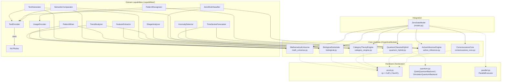

# Architecture Overview

ZeroDataModel is a self-sufficient cognitive system that requires **no external
training data**. It is organised as four layers, with `ZeroDataModel`
(`src/zero_data_model/model.py`) as the single integration point that owns one
instance of every core module and every domain capability.

## Four-layer stack

```
                         ┌─────────────────────────────────────────────┐
                         │            ZeroDataModel (model.py)         │
                         │   think() · classify_text() · forecast()    │
                         │   recognize_pattern() · solve() · ...       │
                         └────────────────────┬────────────────────────┘
                                              │ owns / composes
            ┌─────────────────────────────────┼─────────────────────────────────┐
            │                                 │                                 │
            ▼                                 ▼                                 ▼
  ┌──────────────────────┐     ┌──────────────────────────────┐    ┌──────────────────────────┐
  │  DOMAIN CAPABILITIES │     │        CORE MODULES (6)      │    │   HARDWARE LAYER         │
  │  (capabilities/)     │     │       (root of package)      │    │   (hardware/)            │
  │                      │     │                              │    │                          │
  │  NLP   Vision        │◄────┤  ConsciousnessCore           │◄───┤  accel.py  (CuPy/NumPy)  │
  │  Analytics  Rules    │     │  ActiveInferenceEngine       │    │  quantum.py (Qiskit/sim) │
  │                      │     │  CategoryTheoryEngine        │    │  parallel.py (joblib)    │
  │  compose core +      │     │  QuantumClassicalHybrid      │    │                          │
  │  rule priors         │     │  BiologicalSubstrate         │    │  auto-detected, graceful │
  │                      │     │  MathematicalUniverse        │    │  degradation to NumPy    │
  └──────────────────────┘     └──────────────────────────────┘    └──────────────────────────┘
                                              │
                                              ▼  feature-flagged hooks (all default OFF)
                         ┌────────────────────────────────────────────────────────────┐
                         │            COGNITIVE-UPGRADE LAYER (Phase 7)               │
                         │   plasticity/ cogtime/ cogmem/ knowledge/ metacog/         │
                         │   experiment/ multiagent/                                  │
                         │                                                            │
                         │  1. ArchitectureOptimizer    (enable_architect)            │
                         │  2. LayeredPredictor, TemporalMemory (enable_layered_…)    │
                         │  3. EpisodicGraph, SemanticIndex    (enable_episodic_…)    │
                         │  4. LogicLayer, CausalInference     (enable_logic_layer)   │
                         │  5. MetaCognition                   (enable_meta_cognition)│
                         │  6. BayesianExperimentPlanner, HypothesisTester            │
                         │                                     (enable_experiment_…)   │
                         │  7. MultiAgentWorld, CommunicationChannel, CulturePropagation│
                         │                                                            │
                         │  reads core state, appends metadata — never mutates core  │
                         └────────────────────────────────────────────────────────────┘
```

- **Hardware layer** (`src/zero_data_model/hardware/`) — auto-selects the best
  available backend (GPU arrays, real Qiskit circuits, parallel workers) and
  degrades to pure NumPy on CPU when an optional dependency is missing.
- **Core modules** (`src/zero_data_model/*.py`) — six `CognitiveModule`
  subclasses that each implement `process()`, `predict()`, `update()`. They are
  theory-driven (consciousness, active inference, category theory, quantum,
  biology, mathematics) and self-generating.
- **Domain capabilities** (`src/zero_data_model/capabilities/`) — twelve
  user-facing capabilities across NLP, Vision and Analytics. Each one composes
  one or more core modules with a small rule library (`rules.py`) used as
  inductive prior — never as learned weights.
- **Cognitive-upgrade layer** — seven optional phases that grow the fixed
  six-module core into a plastic, time-layered, structured-memory,
  neuro-symbolic, meta-cognitive, actively-experimenting, multi-agent
  architecture. Every phase is gated by a `ZeroDataModel.__init__` feature flag
  (e.g. `enable_architect`, `enable_meta_cognition`) and defaults to **off**.
  When enabled, each phase registers a hook at the end of `think()` that reads
  already-computed core state and appends keys to
  `Signal.metadata["cognitive_upgrades"]`; it never alters the six core modules'
  computation, so the no-upgrade baseline is byte-for-byte zero-regression.

`ZeroDataModel.__init__` wires the layers together: it instantiates the six core
modules, then constructs each capability, injecting the shared core-module
instances (e.g. `SemanticComparator(self.nlp_text_encoder, self.math_universe,
self.category_engine)`). All capabilities therefore share a single set of core
modules, which is what makes cross-domain transfer cheap. When a cognitive-upgrade
feature flag is set, the corresponding phase module is lazily imported and
constructed (`self.architect`, `self.layered_predictor`, …, `self.hypothesis_tester`)
and left as `None` otherwise, so the import cost is paid only when used.

## Module dependency graph

The diagram below shows which core module each capability depends on, and which
hardware backend each core module can use. Solid arrows are hard dependencies
constructed in `model.py`; dashed arrows are optional hardware acceleration.



Notes:

- `TextEncoder`, `ImageEncoder` and friends also pull a `*Rules` object from
  `rules.py`; the rules are minimal inductive priors (stop-words, Sobel kernels,
  moving-average windows) — not data.
- `ZeroDataModel.think()` runs every core module's `process()` through
  `ParallelExecutor.map_modules()`, so the six modules execute concurrently when
  more than one core is available.

## Design principles

### Zero-data

No module reads an external dataset, model weights, or pre-trained embedding. The
only "knowledge" the system has is (a) mathematical structure (random matrices
that act as inductive scaffolds), (b) self-generated structure (DNA crossover in
`DNAStorage.generate`, fractal iteration in `FractalGenerator.generate`,
morphogenetic diffusion in `MorphogeneticField.develop`), and (c) a tiny set of
hand-written rule priors in `capabilities/rules.py`. `ZeroDataModel.think(None)`
demonstrates this concretely: it produces a coherent output from
`_self_generate()` alone.

### Compositional

Every `CognitiveModule` exposes the same trio — `process(Signal) -> Signal`,
`predict(Signal) -> Prediction`, `update(prediction_error) -> None` (defined in
`base.py`). This uniform contract is what lets `think()` fan the same `Signal`
out to six heterogeneous modules in parallel and integrate the results with a
single mean. Domain capabilities are pure compositions: e.g.
`TimeSeriesForecaster` is `ActiveInferenceEngine` + `QuantumClassicalHybrid` +
`AnalyticsRules`; nothing new is learned.

### Rule-augmented

`capabilities/rules.py` ships three rule libraries — `NLPRules` (stop-words,
sentiment lexicon, topic keywords), `VisionRules` (Sobel/Gaussian kernels,
shape names), `AnalyticsRules` (moving-average window, z-score threshold,
seasonal lags). These are **inductive priors**, not training data: they encode
linguistic/image/statistical universals and are consumed deterministically by
the capabilities (e.g. `TextEncoder.encode` hashes topic-keyword matches into
the embedding; `FeatureExtractor.extract` convolves Sobel kernels).

### Graceful degradation

Every optional dependency (`cupy`, `qiskit`, `numba`, `joblib`) is wrapped in a
`try/except ImportError` with a working pure-NumPy fallback. The system therefore
runs with **zero optional dependencies** (only `numpy` + `scipy` required) and
transparently upgrades as each dependency appears. `ZeroDataModel.hardware_info`
surfaces which path is active so users can confirm acceleration without
instrumenting the code themselves.

### Theory-driven, not data-driven

Each core module is a direct implementation of a named scientific theory —
Global Workspace Theory, Predictive Processing, the Free Energy Principle,
category/topos theory, variational quantum circuits, biological morphogenesis,
and information geometry.

## Where to next

- [Core Modules](core.md) — the six core `CognitiveModule` subclasses in detail.
- [Cognitive Upgrades](cognitive-upgrades.md) — the seven optional phases.
- [Thread Model](thread-model.md) — Phase D lockless core + per-module RLocks.
