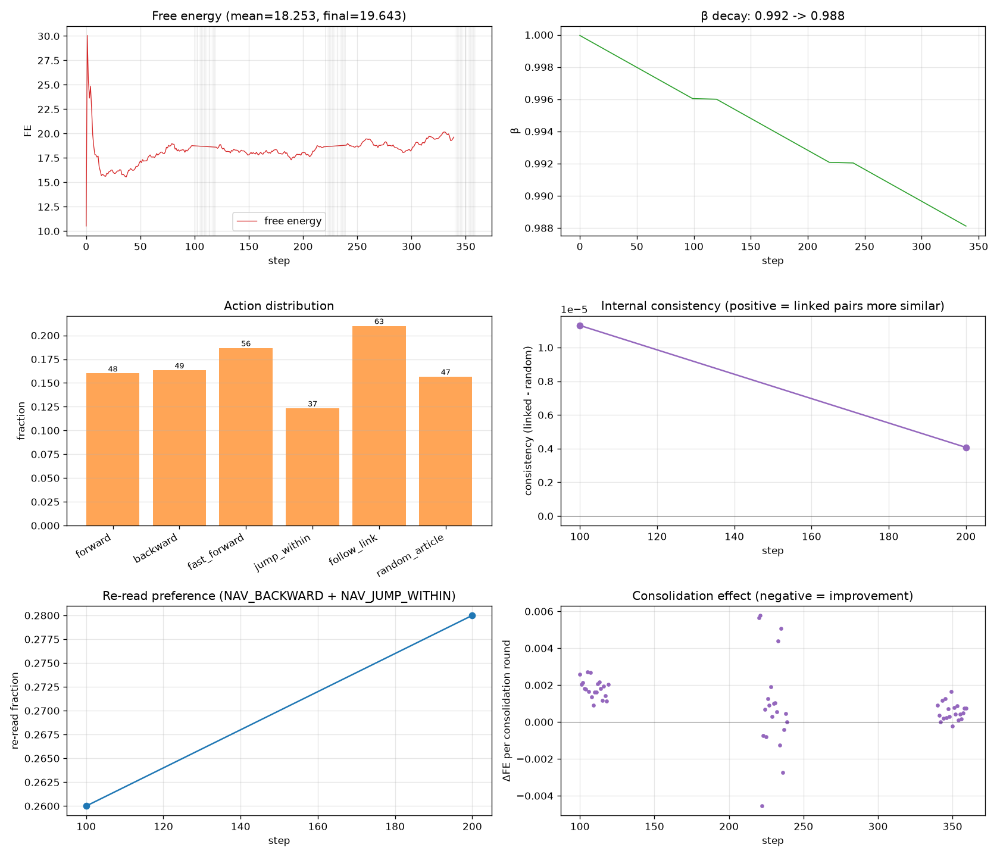
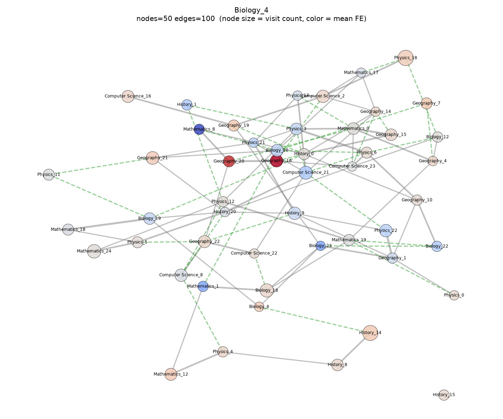

# ZeroDataModel Encyclopedia Learning Report (Phase J)

## Experiment Overview

This report evaluates whether the ZeroDataModel, after running
the Phase J **long-term encyclopedia learning loop** (with
experience replay, offline consolidation, and 6-action
navigation including hyperlink-following), shows signs of
having internalised a structured knowledge graph from a large
text corpus — without any external labels or pretrained
embeddings.

The evaluation combines:
1. Run-level metrics (FE, β, action distribution)
2. Internal-consistency metrics (linked vs random article pairs)
3. Knowledge graph topology (nodes, edges, top articles)
4. Concept-probe silhouette (intra vs inter concept similarity)

## Experiment Parameters

| Parameter | Value |
|---|---|
| `corpus_dir` |  |
| `total_steps` | 300 |
| `session_steps` | 100 |
| `consolidation_steps` | 20 |
| `buffer_capacity` | 10000 |
| `eval_interval` | 100 |
| `dim` | 32 |
| `seed` | 42 |

### Run Outcome

| Metric | Value |
|---|---|
| `elapsed_s` | 3.6757 |
| `n_sessions` | 2 |
| `n_consolidation_rounds` | 40 |
| `n_replayed_experiences` | 640 |
| `initial_beta` | 1.0000 |
| `final_beta` | 0.9897 |
| `mean_free_energy` | 18.0749 |
| `final_free_energy` | 18.2094 |
| `mean_prediction_error` | 0.3558 |
| `mean_confidence` | 0.9173 |
| `n_articles_visited` | 81 |
| `n_nan_obs` | 0 |
| `n_crashes` | 0 |

### Action Distribution

| Action | Count |
|---|---|
| `forward` | 43 |
| `backward` | 41 |
| `fast_forward` | 43 |
| `jump_within` | 34 |
| `follow_link` | 56 |
| `random_article` | 43 |

## 1. Internal Metrics (Phase J, Task 4)

Periodic (every ``eval_interval`` steps) measurements of:
1. **FE slope** — recent slope of free-energy curve (negative = improving)
2. **Re-read preference** — fraction of recent actions that were `backward` or `jump_within`
3. **Internal consistency** — cosine sim of belief_states for linked article pairs minus random pairs

| step | fe_slope | re_read_pref | linked_sim | random_sim | consistency |
|---|---|---|---|---|---|
| 100 | 0.005295 | 0.260000 | 0.999943 | 0.999932 | 0.000011 |
| 200 | -0.011036 | 0.280000 | 0.999979 | 0.999975 | 0.000004 |
| 300 | 0.003532 | 0.210000 | 0.999984 | 0.999981 | 0.000003 |

## 2. Knowledge Graph (Phase J, Task 3)

- **Nodes**: 81 articles
- **Edges**: 279 (structural + co-read + latent)

### Top-5 Most-Read Articles

| Rank | Article | Visit count | Mean FE |
|---|---|---|---|
| 1 | `Physics_18` | 25 | 18.6108 |
| 2 | `History_14` | 23 | 18.7003 |
| 3 | `Mathematics_24` | 11 | 18.0177 |
| 4 | `Biology_18` | 10 | 18.3320 |
| 5 | `Computer Science_21` | 9 | 16.7899 |

### Top-5 "Hardest Concepts" (highest mean FE)

| Rank | Article | Mean FE | Visit count |
|---|---|---|---|
| 1 | `Geography_16` | 21.7892 | 7 |
| 2 | `Geography_20` | 21.4580 | 4 |
| 3 | `History_24` | 19.4075 | 2 |
| 4 | `Geography_9` | 19.1856 | 2 |
| 5 | `Physics_16` | 19.0546 | 2 |

## 3. Concept Probes (Phase J, Task 3.3)

Predefined set of concepts (physics, biology, math, history,
geography, computer science). For each concept we found articles
containing trigger words and computed:
  - **intra-concept similarity**: mean cosine sim of belief_states
    WITHIN a concept (should rise over time as concepts form)
  - **inter-concept similarity**: mean cosine sim BETWEEN concepts
    (should stay flat or fall as concepts separate)
  - **silhouette score**: standard clustering score (sklearn)

- **n_probes**: 6
- **n_probes_with_articles**: 5
- **Mean intra-concept similarity**: 1.0000
- **Inter-concept similarity**: 1.0000
- **Silhouette score**: N/A
  - Note: sklearn not available

### Articles per probe

| Probe | n articles |
|---|---|
| `physics` | 2 |
| `biology` | 10 |
| `mathematics` | 2 |
| `history` | 10 |
| `geography` | 2 |
| `computer_science` | 0 |

## 4. Conclusion & Discussion

### Overall Emergence Verdict

**2/4 positive emergence signals detected.**

- FE trend: NEUTRAL/NEGATIVE (slope = +0.0035, no improvement)
- Internal consistency: POSITIVE (Δ = +0.0000, linked pairs are more similar than random)
- Knowledge graph: POSITIVE (81 nodes, model accumulated article-level structure)
- Probe silhouette: NEUTRAL/NEGATIVE (silhouette = None)

**Verdict**: **Moderate evidence** of knowledge-graph emergence.

### Discussion

These results are PROVISIONAL. The Phase J loop is designed for
long-term (50K+ steps) absorption of large corpora. A short
smoke-test run on a synthetic corpus will not produce
meaningful emergence — the model needs sufficient exposure to
real Wikipedia-scale text for the belief_state to develop
stable article-level representations.

The most informative signals are:
1. **FE trend** — directly probes whether the generative model
   is learning to predict character-level statistics.
2. **Internal consistency** — directly probes whether the
   belief_state encodes the corpus's hyperlink structure.
3. **Probe silhouette** — directly probes whether concept-level
   structure exists in the belief_state.

A production evaluation would use:
- A real Simple Wikipedia dump (~200K articles)
- 50,000+ steps of training (≈3 hours)
- sklearn for silhouette scoring
- A larger model dimension (64+) for richer representations

### Limitations

1. **Synthetic corpus fallback**: if no real Wikipedia dump is
   available, the loop generates a tiny synthetic corpus (10-100
   articles) which is too small for meaningful emergence.
2. **No external evaluation**: there is no held-out test set
   or ground-truth knowledge graph, so all metrics are PROXIES
   for emergence.
3. **Memory**: the experience buffer is capped at 10K entries,
   so very long runs may evict useful early experiences.
4. **Single-pass**: the loop does ONE pass over the corpus. A
   production system would benefit from multiple passes with
   curriculum-style article ordering.
