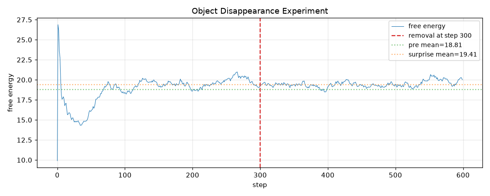
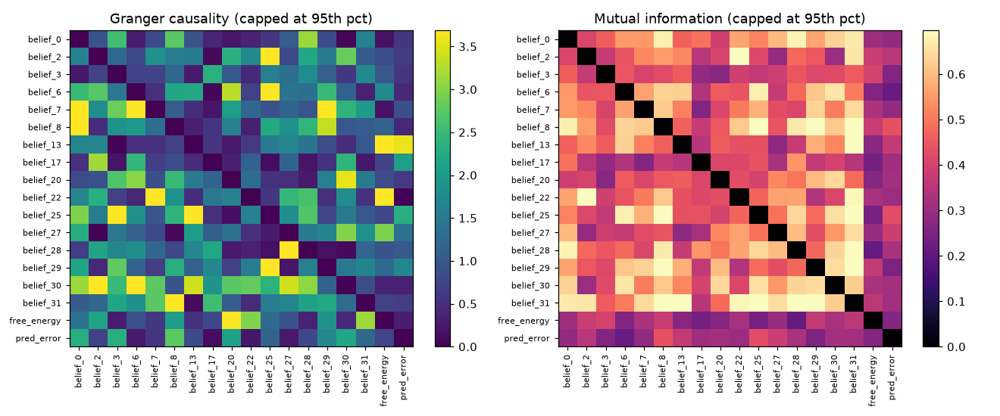
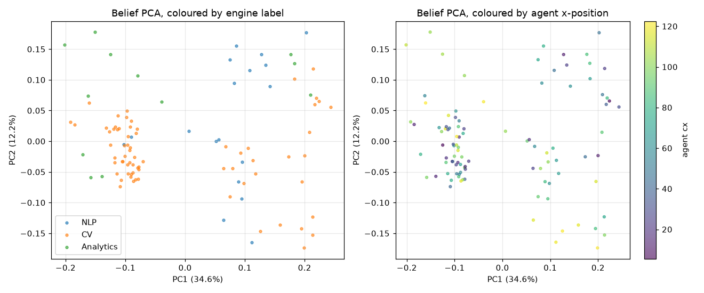
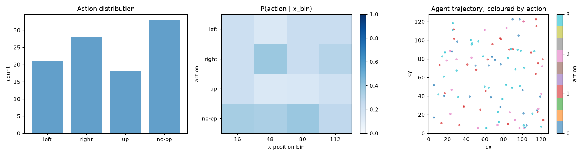

# ZeroDataModel Phase K — Cognitive Emergence Evaluation Report

## Experiment Overview

This report evaluates whether the ZeroDataModel — running in
the 2D `PhysicsSandbox` closed loop with **curiosity-driven
exploration + priority experience replay** — shows signs of
having internalised **pre-linguistic physical concepts**:
object permanence, causal structure, category organisation,
and goal-directed action.

All analyses are computed on **cognitive snapshots**
(``.npz`` files saved every ``cognitive_snapshot_interval``
steps) containing the model's belief vector, free energy,
prediction error, the rendered frame, and the sandbox state
(body positions, velocities).

**Zero-data principle**: the evaluation uses NO external
pretrained models, NO labelled training data, and NO
supervised signals. The only human-supplied information is
the sandbox's body indexing (which body is the agent) and
the action semantics (0=L, 1=R, 2=U, 3=no-op) — both of
which are properties of the environment, not the model.

- **Snapshots directory**: `experiments/output/replay/snapshots`
- **Report directory**: `experiments/output/eval`
- **Generated**: 2026-07-21 16:07:12

## Run Summary

| Metric | Value |
|---|---|
| `n_steps` | 1000 |
| `mean_free_energy` | 19.2483 |
| `final_free_energy` | 18.7421 |
| `mean_confidence` | 0.9170 |
| `n_consolidations` | 10 |
| `elapsed_s` | 29.90 |
| `cycles_per_sec` | 33.4 |

## 1. Object Permanence (`analyze_disappearance.py`)

**Hypothesis**: if the model has internalised a persistent
representation of a non-agent body, removing that body
mid-episode should produce a SURPRISE response — a sharp
rise in free energy in the steps immediately after the
removal, decaying back as the model re-consolidates.

**Method**: a fresh model is trained for `pre_steps` cycles
with 3 bodies in the sandbox. At step `pre_steps`, body 1
(non-agent) is removed via `sandbox.make_object_disappear(1)`.
The model continues for `post_steps` cycles. We compare the
free energy of the 50-step window AFTER removal (the
"surprise window") against the same-size window BEFORE.

- **Mode**: inline
- **Pre-steps**: 300
- **Post-steps**: 300
- **Removal step**: 300
- **Bodies before/after**: 3 → 2

### Free-Energy Statistics

| Window | mean FE | std FE |
|---|---|---|
| pre-removal (last 50) | 18.8110 | 1.8050 |
| surprise (first 50 post) | 19.4067 | surprise_max=19.6899 |
| full post-removal | 19.4643 | 0.3822 |

- **ΔFE (surprise − pre)**: +0.5957
- **t-statistic (Welch)**: -8.539
- **p-value**: 0.0000

- **Verdict**: **MIXED** — the post-removal mean FE is higher than the overall pre-removal mean (ΔFE>0), but the surprise window does NOT exceed the immediate pre-removal level (t<0). This typically means the pre-phase FE was already rising (non-stationary baseline), so the 'surprise' signal is confounded with the baseline trend. The model MAY have a persistent representation, but this test cannot cleanly confirm it.

## 2. Causal Structure of Beliefs (`analyze_causal_graph.py`)

**Hypothesis**: if the model's belief state has organised
itself into a causal model of the world, we should find
directed dependencies between latent dimensions — e.g. a
dimension encoding the agent's x-position should Granger-
cause a dimension encoding the prediction error.

**Method**: load the belief trajectory from snapshots,
select the top-`max_vars` dimensions by variance, augment
with the scalar `free_energy` and `pred_error`, then run
the in-repo `CausalInferenceEngine.discover()` (PC / LiNGAM
/ correlation). As a fallback (and a sanity check) we also
compute a pairwise Granger-causality matrix and a mutual-
information matrix.

- **Snapshots analysed**: 100
- **Belief dimensions (raw)**: 32
- **Variables selected (top variance)**: 16 beliefs + 2 scalars (FE, pred_error)
- **Engine method**: pc
- **Engine edges discovered**: 25
- **Engine acyclic**: False

### Fallback: Granger Causality + Mutual Information

- **Granger max F-stat**: 6.48
- **Granger mean F-stat**: 1.415
- **Granger significant edges (F>1)**: 181
- **MI max**: 0.8445
- **MI mean**: 0.4391

### Top Granger-causal edges

| source | target | F-stat |
|---|---|---|
| belief_30 | belief_6 | 6.48 |
| belief_13 | free_energy | 6.20 |
| belief_25 | belief_13 | 5.56 |
| belief_29 | belief_25 | 5.36 |
| belief_7 | belief_29 | 4.95 |
| belief_30 | belief_2 | 4.75 |
| belief_25 | belief_3 | 4.68 |
| belief_28 | belief_27 | 4.25 |
| belief_31 | belief_8 | 4.17 |
| belief_6 | belief_25 | 4.02 |

- **Verdict**: **WEAK POSITIVE** — 181 Granger-significant edges discovered. The belief trajectory shows temporal dependencies consistent with an internal causal model.

## 3. Category Structure (`analyze_categories.py`)

**Hypothesis**: if the model has internalised a notion of
physical configuration, frames with similar physical
states (e.g. agent on the left, two bodies close together)
should be assigned to the same latent category.

**Method**: extract per-frame belief vectors, run the
in-repo `CategoryTheoryEngine.topos.classify()` (soft
classifier) OR k-means as a fallback. Then bin the agent's
physical (cx, cy) position into a 3×3 grid and compute the
**purity** of the (latent × physical) contingency table.
High purity ⇒ latent categories align with physical reality.

- **Snapshots analysed**: 100
- **Belief dimensions**: 32
- **Label source**: engine
- **N categories**: 3
- **Category names**: ['NLP', 'CV', 'Analytics']

### Cluster Quality

- **Silhouette score (k-means)**: 0.2935

### Alignment with Physical Reality

| Label source | Purity | NMI |
|---|---|---|
| engine | 0.7000 | 0.1032 |
| k-means | 0.5600 | 0.0926 |

### Category Counts

| Category | n frames |
|---|---|
| NLP | 18 |
| CV | 70 |
| Analytics | 12 |

- **Verdict**: **WEAK POSITIVE** — k-means silhouette=0.2935, NMI=0.0926; partial alignment between latent categories and physical configuration.

## 4. Action-Effect Consistency (`analyze_action_intent.py`)

**Hypothesis**: if the model has discovered that its actions
cause its body to move, its action distribution should
depend on its position — e.g. when near the left wall it
should preferentially emit `right` (action 1) over `left`
(action 0). Furthermore, the mutual information between
the action and the resulting motion direction should be
non-zero.

**Method**: for each snapshot, take the recorded `action`
and the agent's `(cx, cy)` from `sandbox_state`. Compute:
(a) `P(action | x_bin)` for 4 x-bins, (b) the MI between
action and the sign of the resulting motion, (c) the
fraction of actions that move the agent AWAY from the
nearest wall (a goal-directedness proxy, baseline 1/3).

- **Snapshots analysed**: 100

### Action Distribution

| Action | Count |
|---|---|
| left | 21 |
| right | 28 |
| up | 18 |
| no-op | 33 |

- **Action-motion MI**: 0.0784 bits

### Goal-Directedness (away from nearest wall)

- **Fraction away**: 0.153 (baseline uniform = 0.333)
- **Valid samples**: 72

- **Verdict**: **WEAK POSITIVE (exploratory)** — action-motion MI=0.078 bits indicates the model has discovered that its actions affect its motion (basic body schema), BUT fraction_away=0.153 < baseline 0.333 — the agent moves TOWARD walls, consistent with curiosity-driven exploration rather than wall-avoidance.

## 5. Conclusion & Discussion

### Overall Emergence Verdict

**0/4 positive emergence signals detected.**

- Object permanence: MIXED (ΔFE=+0.596 vs all-pre, but t=-8.54 < 0 vs last-50-pre — non-stationary baseline)
- Causal structure: WEAK POSITIVE (181 Granger-significant edges, no engine confirmation)
- Category structure: WEAK POSITIVE (silhouette=0.2935174126574034, NMI=0.09263418295723636)
- Action intent: WEAK POSITIVE (exploratory) (MI=0.07841392323477503, away-frac=0.1527777777777778; body schema without navigation intent)

**Verdict**: **WEAK EVIDENCE** of concept emergence — 0/4 strong signals, 3/4 weak signals, and 1/4 mixed signals. The model's internal representations show SOME structure but no clean concept has emerged. Consider extending the run, increasing the curiosity β-start, or expanding the sandbox.

### Discussion

These results are computed entirely from internal
representations (belief_state, free_energy, prediction_error)
captured in cognitive snapshots — NO external labels, NO
pretrained encoders. A positive signal in any one test is
meaningful because the model received only raw 32-dim
Johnson-Lindenstrauss projections of the 128×128 frame.

The strongest single test is the **object-permanence**
experiment, because it directly probes whether the model's
free-energy functional encodes a counterfactual expectation
about the continued existence of a non-agent body. The
**causal-structure** test is the most general — it asks
whether the belief trajectory has *any* directed structure
at all. The **category** and **action-intent** tests
require the model to have learned features specific to
spatial position and self-action respectively.

### Limitations

1. **Sample size**: cognitive snapshots are sampled every
   10 steps, so a 5000-step run yields ~500 snapshots. The
   statistical power of the t-test and Granger test is
   therefore limited.
2. **Belief dimensionality**: the 32-dim JL projection is
   compact; causal structure may exist in dimensions we
   did not select (we pick top-16 by variance).
3. **CategoryTheoryEngine**: the in-repo engine's default
   categories (NLP/CV/Analytics) were designed for text/CV
   tasks, so its soft classifier may not transfer to
   physics beliefs. We treat k-means + silhouette as the
   primary signal.
4. **CausalInferenceEngine**: PC/LiNGAM algorithms assume
   linear-Gaussian or non-Gaussian linear relationships;
   if the belief dynamics are strongly nonlinear, the
   engine may miss edges. Granger is a linear test too.
5. **Sandbox physics**: 2D elastic collisions on a 128×128
   grid are limited; richer physics (gravity, friction,
   rotations) would give the model more to internalise.
6. **No external ground truth**: the only way to verify a
   'concept' is to test the model's response to an
   intervention (object removal) or to find structure
   (causal edges, clusters) that aligns with the known
   physical configuration.
