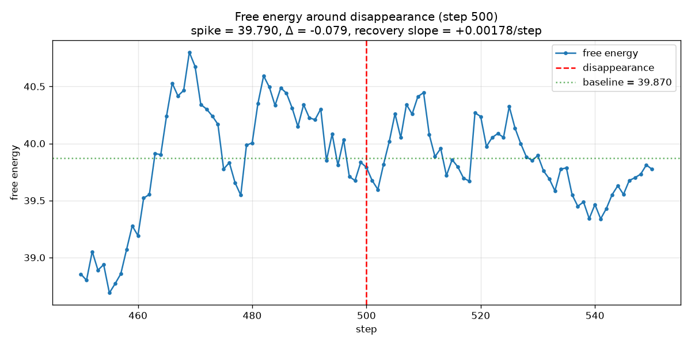
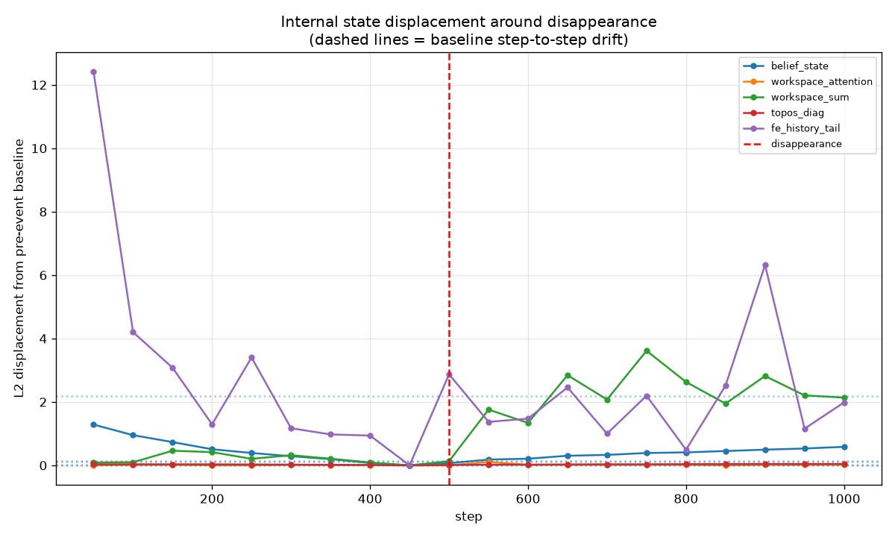
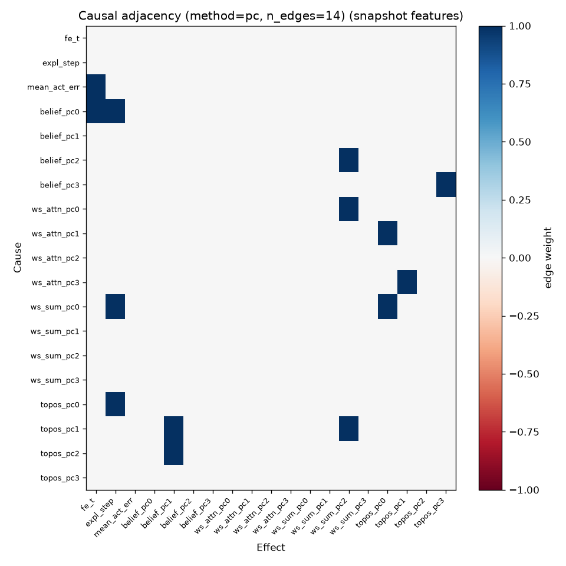
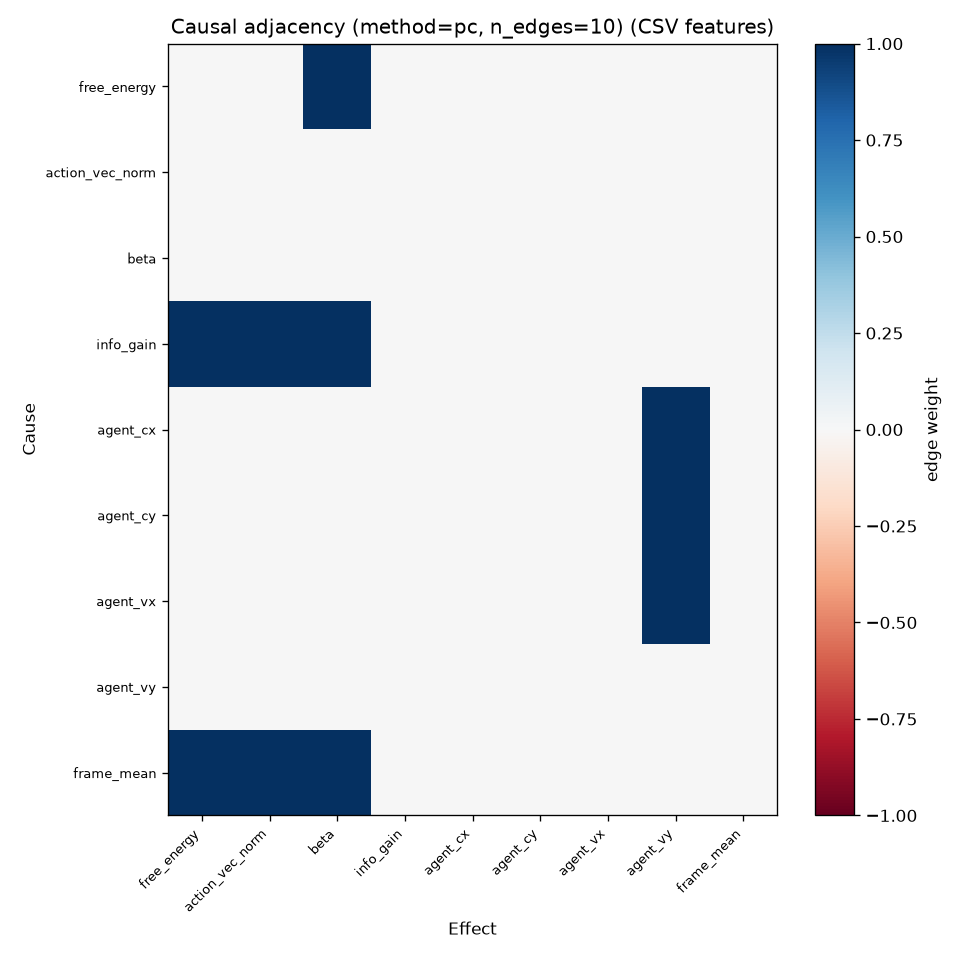
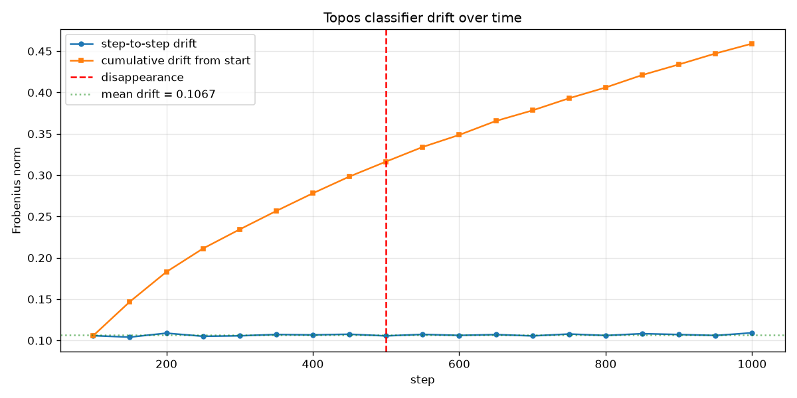
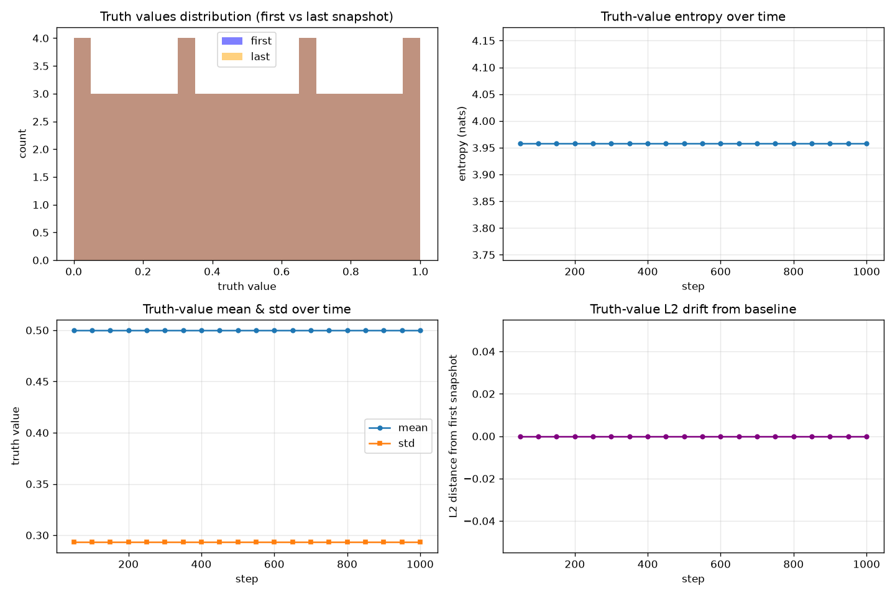
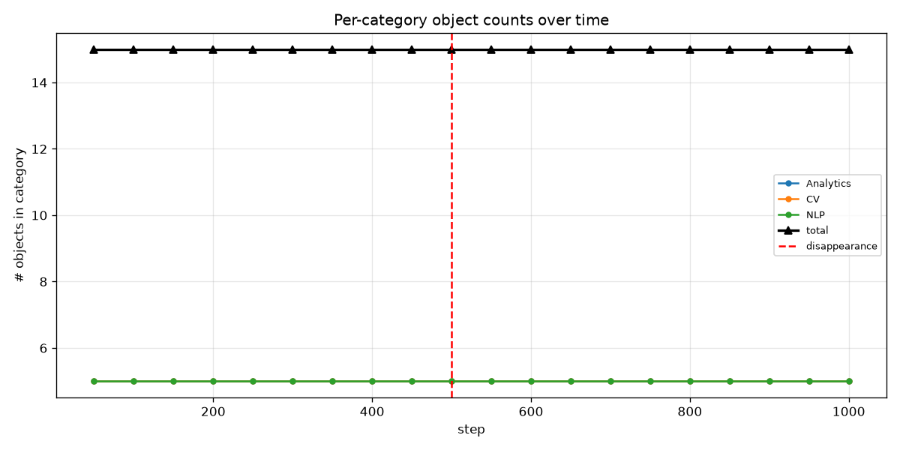
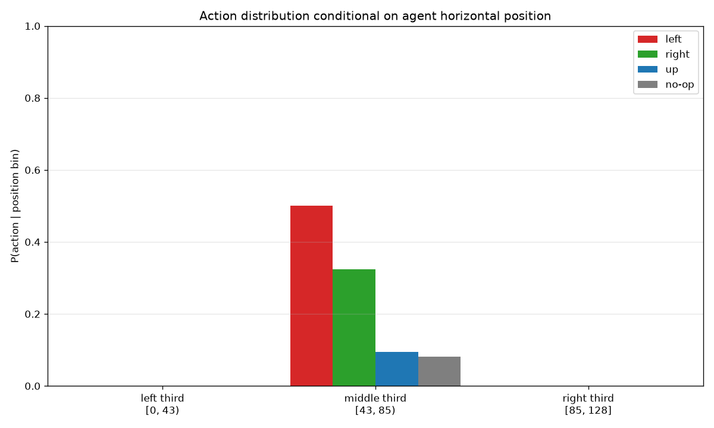

# Cognitive Emergence Evaluation — Final Report

_Generated by `run_full_evaluation.py` on 2026-07-21 05:06:49 UTC_.

## 1. Experiment Configuration

| Parameter | Value |
|---|---|
| Model dim | 64 |
| Random seed | 42 |
| Initial sandbox bodies | 3 |
| Total steps | 1000 |
| Snapshot interval | every 50 steps |
| Total snapshots saved | 20 |
| Disappearance step | 500 |
| Disappearance object index | 1 |
| Sleep interval | every 200 steps |
| Sleep rounds per phase | 3 |
| Total elapsed | 113.9s |

## 2. Disappearance Intervention (Object Permanence)

| Metric | Value |
|---|---|
| FE baseline (pre-event) | 39.8697 |
| FE at event | 39.7903 |
| FE Δ at event | -0.0794 |
| FE recovery slope (per step) | +0.00178 |
| Manifest ΔFE (before→after) | 39.8347 → 39.7903 (-0.0443) |

**Interpretation:** FE spike = -0.2% of baseline: no significant surprise — model likely has not built a representation of this object (or runs longer than needed to detect). Recovery slope = +0.00178/step (>=0): no clear recovery — model has not re-learned the new scene within the recovery window. No internal state vector shifted >= 2x baseline drift — either the model has no dedicated object slot, or the run is too short for the representation to have stabilised.

## 3. Causal Graph (Internal State Time Series)

| Feature set | Variables | Edges discovered | Method | Acyclic? |
|---|---|---|---|---|
| Snapshots | 19 | 14 | pc | True |
| CSV (dense) | 9 | 10 | pc | True |

Snapshot-feature edges:
| Cause | Effect | Weight |
|---|---|---|
| mean_act_err | fe_t | +1.0000 |
| belief_pc0 | fe_t | +1.0000 |
| belief_pc0 | expl_step | +1.0000 |
| belief_pc2 | ws_sum_pc2 | +1.0000 |
| belief_pc3 | topos_pc3 | +1.0000 |
| ws_attn_pc0 | ws_sum_pc2 | +1.0000 |
| ws_attn_pc1 | topos_pc0 | +1.0000 |
| ws_attn_pc3 | topos_pc1 | +1.0000 |
| ws_sum_pc0 | expl_step | +1.0000 |
| ws_sum_pc0 | topos_pc0 | +1.0000 |
| topos_pc0 | expl_step | +1.0000 |
| topos_pc1 | belief_pc1 | +1.0000 |
| topos_pc1 | ws_sum_pc2 | +1.0000 |
| topos_pc2 | belief_pc1 | +1.0000 |

**Interpretation:** Discovered 14 edges from snapshot features. Meaningful edges: 'belief_pc0 -> fe_t' suggests the belief/attention state CAUSES free-energy variation (uncertainty drives surprise) CSV-based analysis discovered 10 edges from the dense per-step log — useful for sanity-checking action-environment couplings (e.g. agent_vx -> agent_cx).

## 4. Category Structure (Topos + Object Counts)

| Metric | Value |
|---|---|
| Mean step-to-step classifier drift | 0.10674474169620621 |
| Final cumulative classifier drift | 0.45913257496833415 |
| Total category objects (pre-event mean) | 15.0 |
| Total category objects (post-event mean) | 15.0 |
| Total category objects (Δ at event) | 0 |

**Interpretation:** Classifier cumulative drift (0.4591) >> mean step drift (0.1067): the topos classifier is accumulating structured changes — suggests the model is USING the topos layer to encode scene statistics. Truth-value entropy stable (3.958 -> 3.958): no clear shift in the truth spectrum. Total category-object count did NOT change at the disappearance step — the engine's object counts are not coupled to the scene's body count (at least not on the snapshot sampling grid).

## 5. Action-Effect Intent

| Metric | Value |
|---|---|
| Mutual information I(action; position) | 0.00000 nats |
| Chi-squared statistic | 0.0 |
| Chi-squared p-value | nan |
| Velocity-action correlation r | -3.989486893561194e-16 |
| Boundary intent score | nan |

**Interpretation:** Mutual information = 0.0000 nats (<=0.01): the model's actions are essentially INDEPENDENT of position — no clear intent signature. Velocity-action correlation r = -0.0000 (near 0): no clear velocity-action coupling.

## 6. Overall Conclusions

**Moderate emergence signal (2/4).** Two independent signatures found — tentative evidence of pre-linguistic physical concepts.

Signals detected:
  - causal structure: 14 edges in snapshot-feature DAG
  - category learning: cumulative classifier drift (0.4591) > 3x mean step drift (0.1067)

## 7. Files Produced

- `manifest.json` — run configuration + paths.

- `replay_log.csv` — dense per-step log.

- `snapshot_step*.pkl` — pickled cognitive snapshots.

- `disappearance_fe_curve.png` / `disappearance_state_drift.png`

- `disappearance_summary.json`

- `causal_graph_snapshots.png` / `causal_graph_csv.png`

- `causal_graph_summary.json`

- `categories_classifier_drift.png` / `categories_truth_values.png` / `categories_object_counts.png`

- `categories_summary.json`

- `action_intent_distribution.png`

- `action_intent_summary.json`

- `FULL_REPORT.md` — this file.
